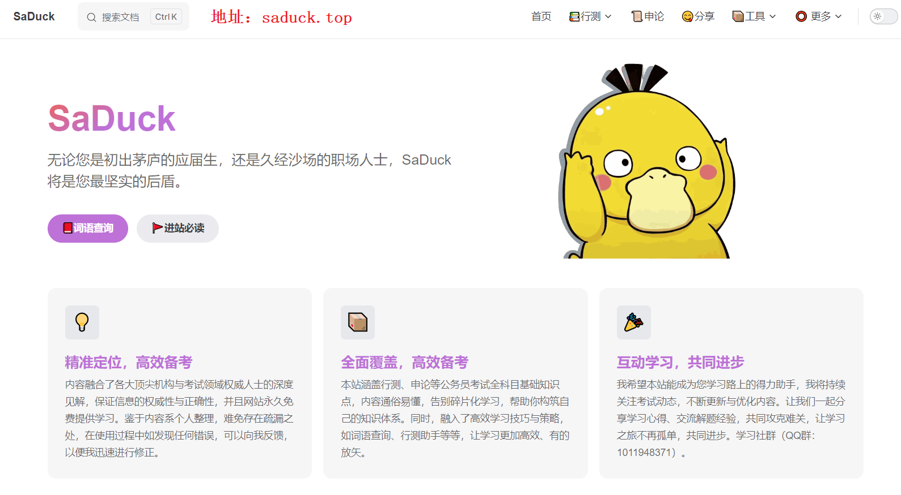

# 公务员

> 模块详细知识学习地址：[Saduck](https://saduck.top)
>
> 

## 目录

* [申论](申论)
* [行测](行测)
* [面试](面试)

### 一、了解公务员考试体系

#### 1. 国家公务员考试（国考）
- **组织单位**：由国家公务员局统一组织。
- **考试时间**：通常在每年的10月份发布公告，11月底或12月初进行笔试，次年3月左右进行面试。
- **职位范围**：涉及中央党群机关、中央国家行政机关、中央国家行政机关直属机构和派出机构、国务院系统参照公务员法管理事业单位等。
- **考试内容**：行政职业能力测验（简称行测）、申论两科，部分职位加试专业科目。
  - 国考行测包含：‌常识判断、‌言语理解与表达、‌数量关系、‌判断推理（图像推理、定义判断、类比推理、逻辑判断）、‌资料分析
#### 2. 地方公务员考试（省考）
- **组织单位**：由各省、自治区、直辖市人事考试中心或公务员局组织。
- **考试时间**：考试时间因省份而异，多集中在每年的3月至5月或9月至11月。
- **职位范围**：主要面向本省（市、区）的党政机关、事业单位等。
- **考试内容**：大部分省份与国考类似，也考行测和申论，但部分省份的考试内容、难度及题型可能有所不同。
  - 注意：如果参加省考，请先去粉笔等App了解往年试卷模块构成内容再选择学习。因为每个省份考试的内容会有一定的差异。
### 二、公考一般流程
1. **报名阶段：** 招考单位报招录计划给人社局（厅、部）和组织部，由其批准后，按照招考计划，发布招考公告（具体请看：招考公告解读）（时间、要求、考试内容根据公考类别不同而不同，具体请看：国考、省考、事业单位招考、教师、军队文职的区别）。
   1. 在指定网站注册个人账号，填写个人信息。
   2. 根据职位表，结合个人条件选择适合的职位。
   3. 上传个人照片、学历学位证书、工作证明（如适用）等必要材料。
   4. 在规定时间内完成报名费用缴纳，并且确认报名成功。
2. **备考阶段：** 学习备考（一个漫长又短暂的过程）。
3. **考前注意事项**:
   1. 身份证+准考证是考试中的必备证件，缺一不可，另外准考证是自行打印。一定要注意！不要错过打印准考证的时间，避免无法参加笔试
   2. 有的考场分配较远，记得提前订酒店，最好离考点2公里以内。不然快考试那天就订不到位置好的酒店了
   3. 透明文具袋主要用来装考试工具，同时符合考场纪律，可直接携带
   4. 2B铅笔需要提前削好，扁平状，忌尖头(容易摔断且不好涂写答题卡)；签字笔，备份2支及以上(或准备2支及以上笔芯)，防止特殊情况。
   5. 手表主要用于查看时间，合理分配各版块的做题时间(PS：是否可以携带机械表以考场为准)
   6. 其余物品：
      - 雨伞:视天气而定，一定要看天气预报。
      - 饮品:自行携带水杯、矿泉水或功能性饮料(主要用于提神，如红牛、咖啡等)；
      - 食物:携带巧克力，适当补充能量(士力架等)
      - 保暖物品:如暖宝、坐垫等，天气寒冷，部分考场没有取暖设施
4. **笔试阶段**：
   1. 根据路程远近合理设定闹钟时间，出门前再一次确认考试用品（准考证、身份证）是否齐全，按时到达考场参加笔试。
   2. 绝对不要携带计算器、各种电子、通信和储存设备以及草稿纸
   3. 考试持续时间比较久，上午行测、下午申论。有专业科目考试，安排在第二天的上午下午。一般需要就近就餐，可以提前看一下考场周围的餐饮店，如果没有合适的餐饮店.也可以提前准备好食品饮品，以备不时之需
   4. 考场上如果有意外情况或什么疑问，是可以举手示意，询问老师
   5. 填写答题卡时，姓名、准考证号及主观题部分用签字笔书写，客观题部分用铅笔填涂。填写关键信息时，一定要谨慎小心，做到准确无遗漏
5. **面试阶段**：
   1. 在笔试一个月左右后，会在报名的网站或者招考单位指定网站，公布笔试成绩（只能查询自己或者下载有所有人成绩的 Excel 表格）。
   2. 复审结束一周左右，会在报名的网站或者招考单位指定网站，公布参加面试公告，要求在指定日期地点（一般设在学校），参加面试。
   3. 根据考试类别不一样，组织面试略有不同。一般为上午 7 点开始，下午 13 点开始，会当场收到你的面试成绩。
   4. 面试结束后一周左右，会在报名的网站或者招考单位指定网站，公布参加公考成绩公告，会有你的笔试成绩、面试成绩以及总成绩，并降序排名（如果后续流程没有问题，基本上你就知道自己是否能上岸）。
6. **体检阶段**：成绩公布一周左右，会在报名的网站或者招考单位指定网站，公布参加体检考察名单公告，告知时间到指定医院参加体检。
7. **政审、考察阶段**：体检原则上是与政审、考察同时进行的。但各地按照工作安排，大多会有先后顺序。体检结束，单位人事部门会通知你，准备相关材料，并于指定时间实地到你工作单位考察。
8. **拟录用阶段**：上述各种流程走完后，招录单位会在报名的网站或者招考单位指定网站，公示拟录用名单。
9. **录用通知**：公示期间没有异议，则会在公示结束后，电话、邮件、邮寄等方式通知你，何时何地去报到。
10. **上班阶段**：恭喜你，顺利上岸！
11. 最后，祝大家在考公之路上一切顺利，早日实现自己的职业梦想！

