## 博客介绍

  

   

## 说明

Utopia博客，一款基于微服务架构的前后端分离博客源码系统。Web端使用vue+elmentui开发，后端采用SpringCloudAlibaba，总共分为3个服务，支持文件本地和云上传，使用ElasticSearch作为全文检索服务，支持QQ、码云、github、微博登录。打造一个简单的快速的微服务项目

## 在线地址

**项目链接：** [Utopia博客](http://113.45.186.233)

您的star是我坚持的动力，感谢大家的支持

## 系统演示

### 前台
#### 首页
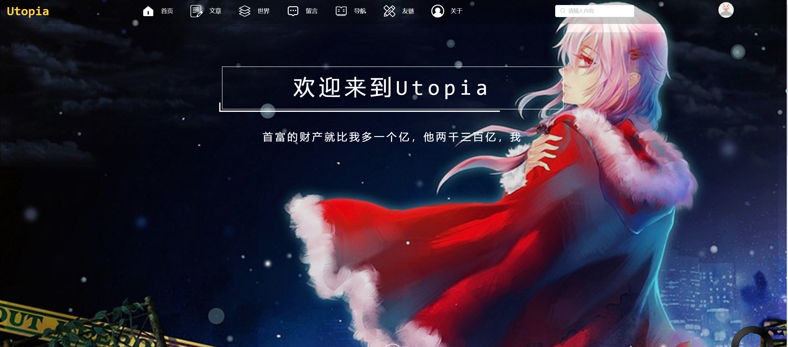
#### 文章列表
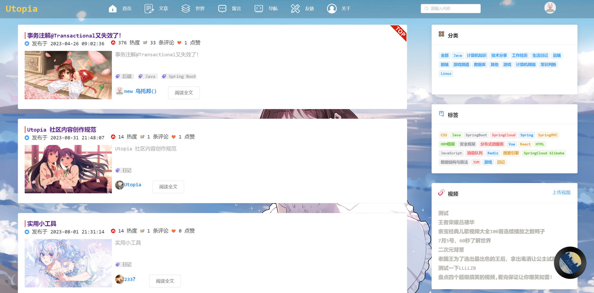
#### 文章详情
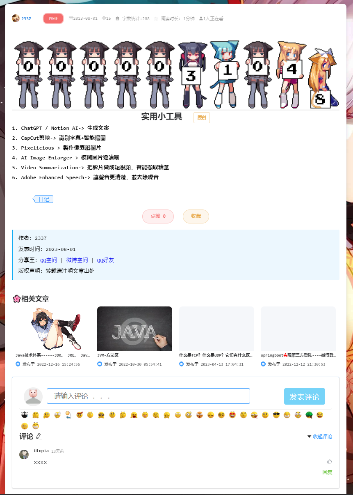
#### 聊天室
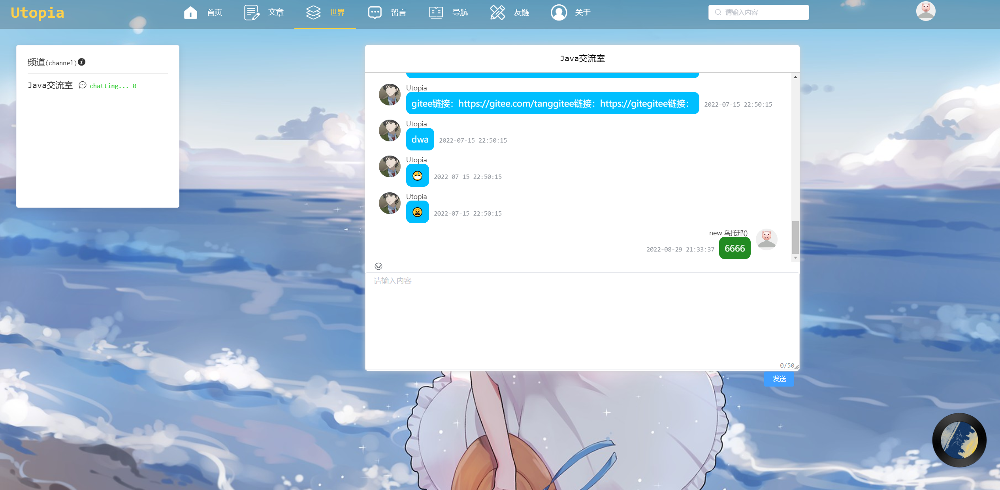
#### 留言
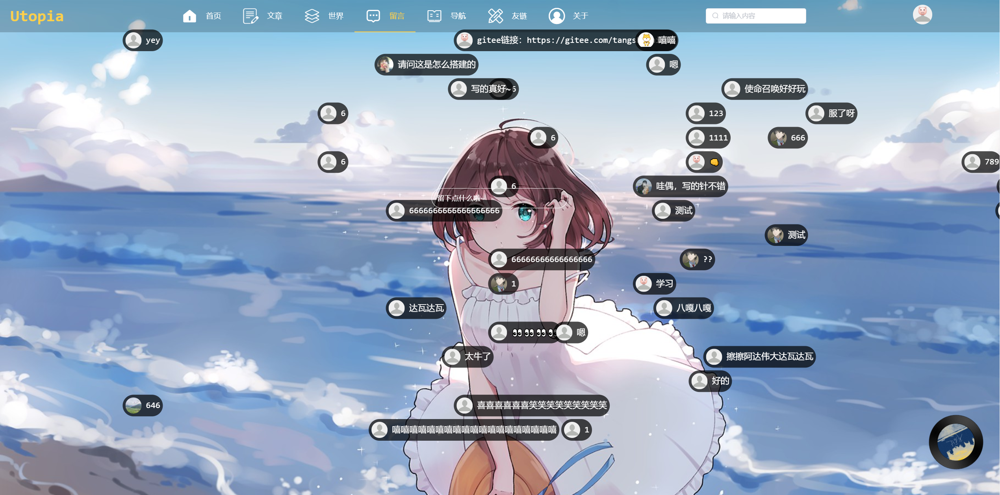
#### 友链
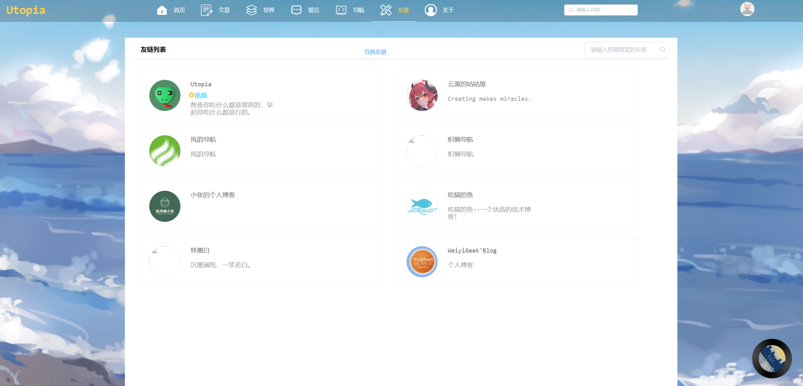
#### 关于
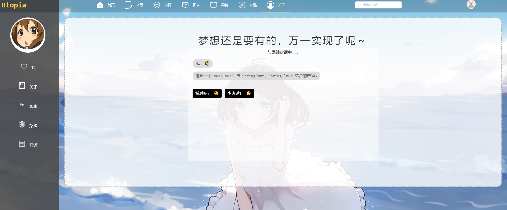
#### 导航
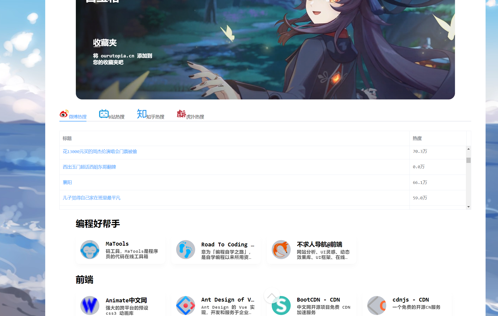
#### 发布文章
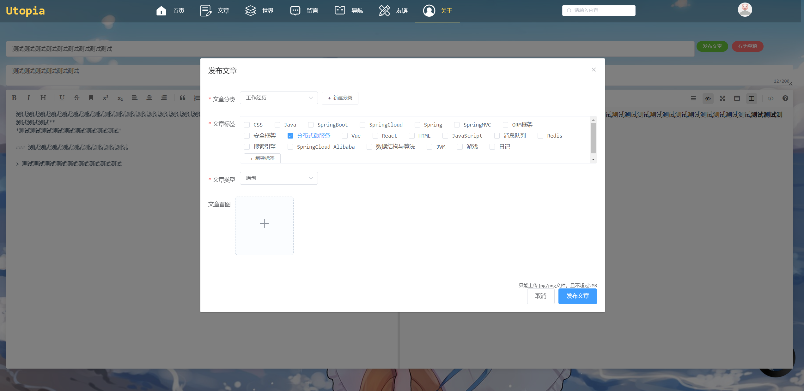
#### 搜索
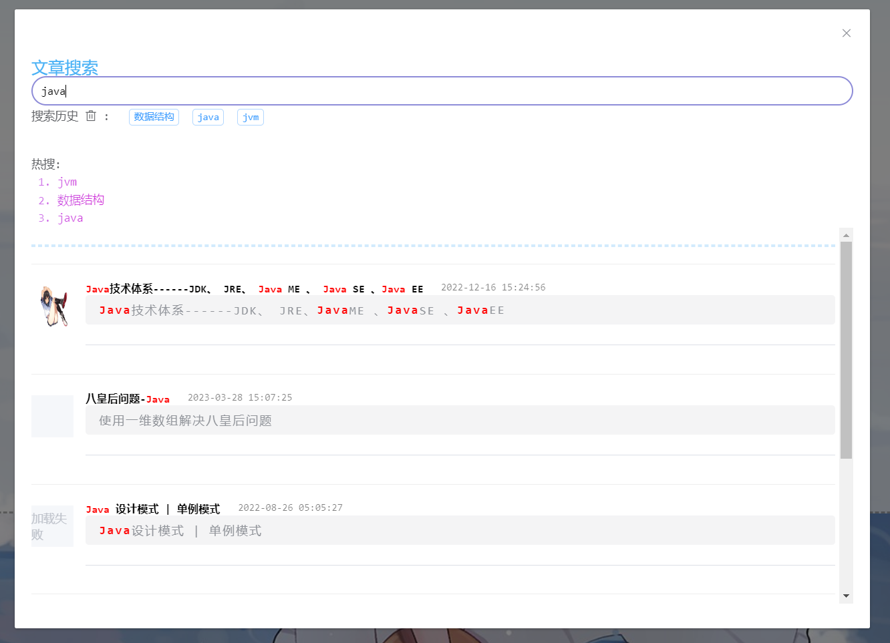
#### 每日练习
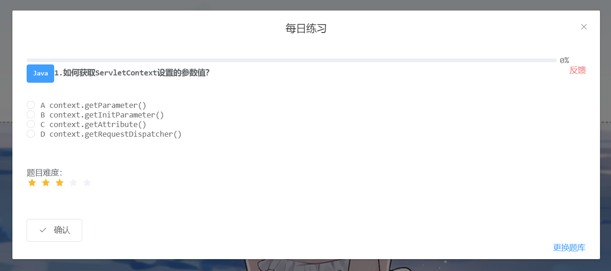
#### 在线简历
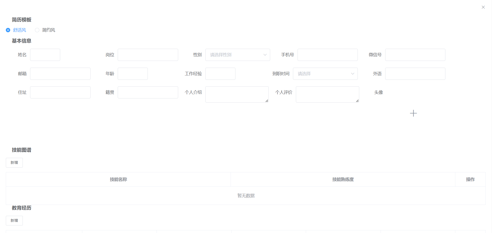
#### 消息中心
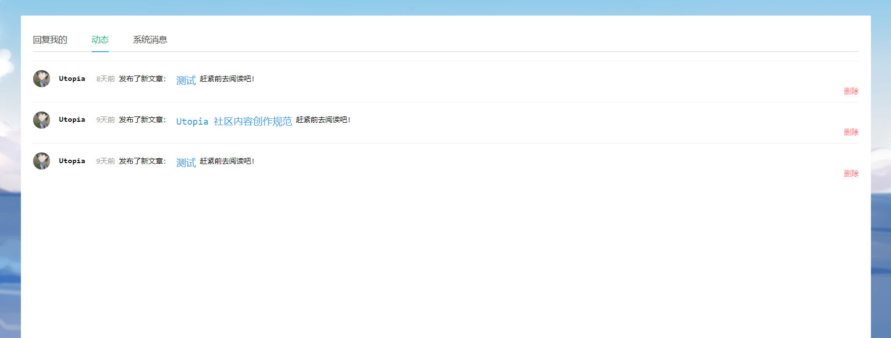

### 后台
#### 首页
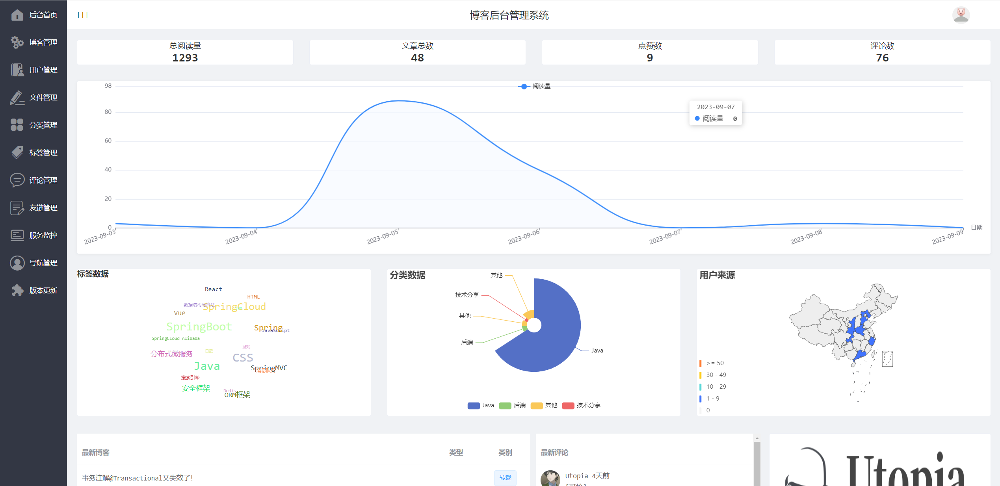
#### 博客管理
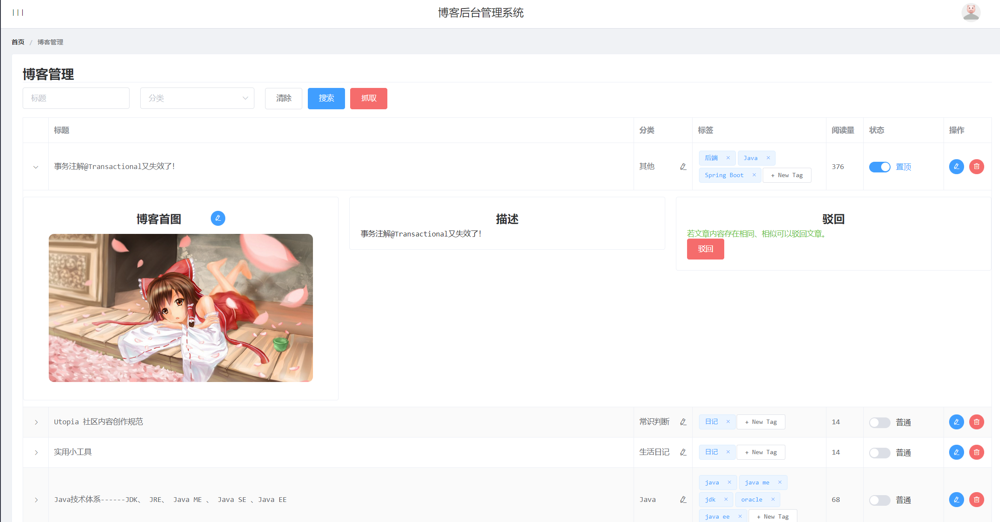
#### 导航管理
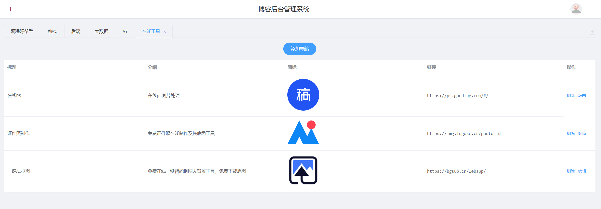
#### 用户管理
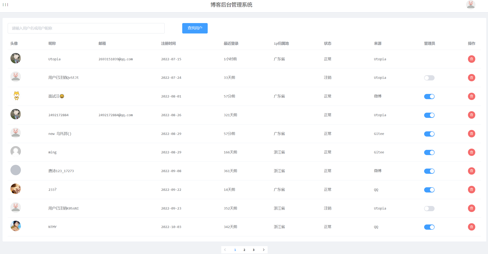
#### 服务监控
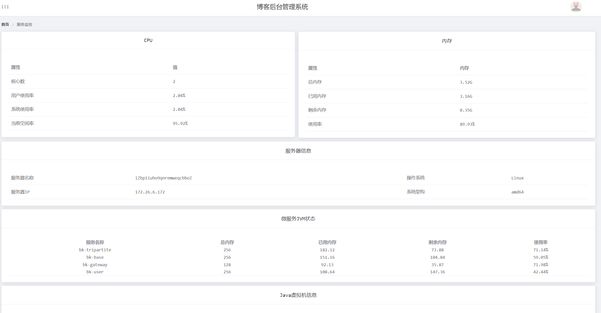

## 前端端技术栈
Vue、Element UI

## 后端端技术栈
Java，Spring Boot、Spring Cloud Alibaba、Mybatis-Plus、Spring Boot Mail...
## 前端部署

**第一步 下载依赖** npm install  --legacy-peer-deps

**第二步 修改配置** 修改\ourutopia\utopia_web\src\apiUrl.js文件里面的后端地址以及社交登录参数

**第三步 运行项目** npm run serve --legacy-peer-deps

**打包命令**  npm run build

**前端部署环境** Nginx

## 后端部署

**第一步** 导入SQL文件

**第二步** 导入Nacos文件、修改配置信息（如：Mysql、Redis连接信息，Nacos 地址、Nacos namespace，ES可选是否配置、Rabbitmq可选是否配置，社交登录密钥，邮箱配置，本地保存路径）

**第三步** 项目导入Idea运行即可

**后端部署环境** Java8、Nacos2.0.4、Mysql5.7、Redis、RabbitMq（可选）、Elasticsearch（可选）

## 运行环境

**推荐服务器：** 腾讯云2核4G CentOS7.6

**对象存储：** 阿里云OSS，支持本地上传

**最低服务器配置：** 1核2G服务器

## 开发环境

|            开发工具            |           说明            |
| ----------------------------- | ------------------------- |
| IDEA                          | Java开发工具IDE            |
| VSCode                        | Vue开发工具                |
| Navicat                       | MySQL远程连接工具          |
| Another Redis Desktop Manager | Redis远程连接工具          |
| finalshell                    | Linux远程连接和文件上传工具 |

